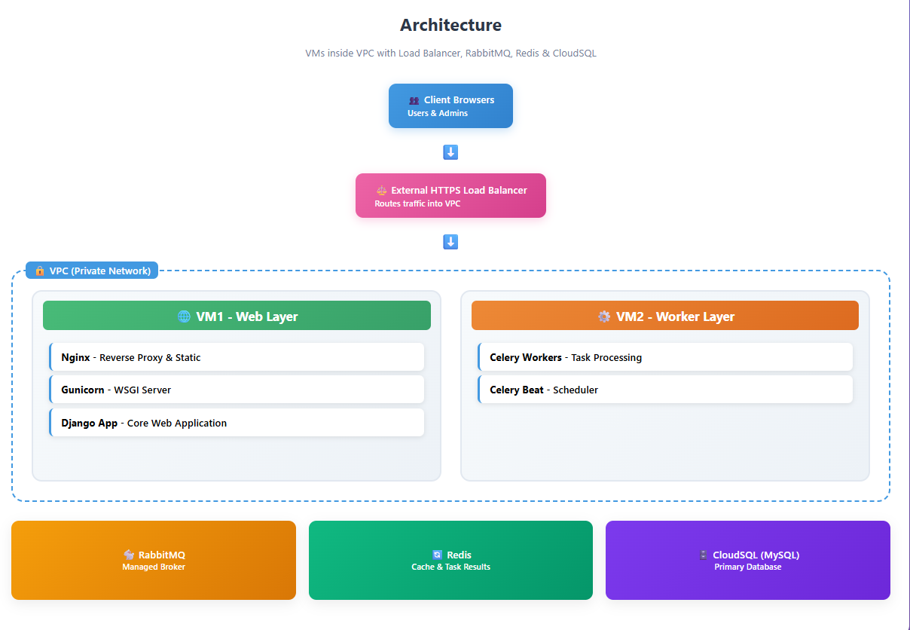
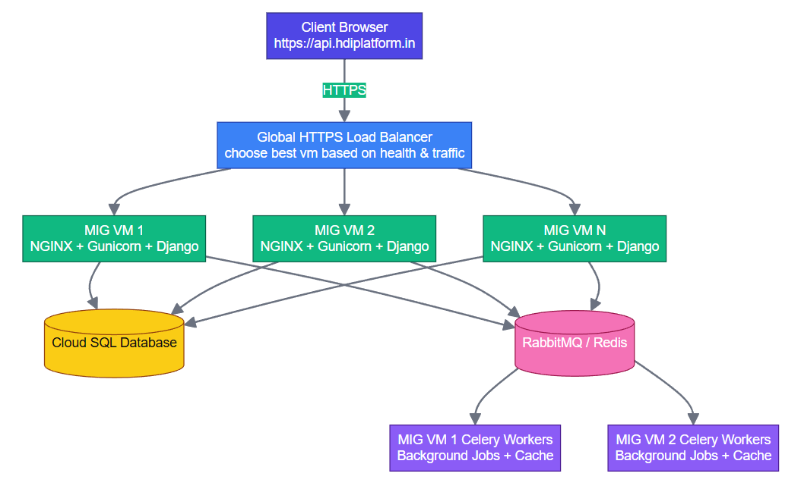

## Auto Scaling - Architecture

VM1 – VM2 stateless applications
VM1 – nginx + code base + gunicorn (apply autoscale - MIG)
VM2 – celery + celery beat (apply autoscale – MIG)
Redis – memory store
Rabbitmq – cloudamqp
Mysql – Cloud SQL

### Load Balancing

Global HTTPS Load Balancer handles: SSL termination (no need to manage certs in NGINX). Global routing and failover across zones. Health checks & autoscaling integration with MIG. DDoS protection (via Cloud Armor). 

### Domain mapping
GCP MIG (Managed Instance Group) will create new VMs when load increases. But… each VM has its own separate ephemeral IP address (unless you manually assign static external IPs, which doesn’t scale well).
Your domain (api.hdiplatform.in) can only point to one IP. That means new VMs can’t be reached by clients directly. Only the original VM’s IP that your domain points to will actually serve traffic.
Autoscaling without LB = useless for client traffic, because clients won’t magically know about the new VMs.
You map your domain (e.g., api.hdiplatform.in) → LB’s static IP.
api.hdiplatform.in → [LB_STATIC_IP]
LB forwards to MIG → MIG distributes traffic to VMs (via Nginx/Gunicorn).

